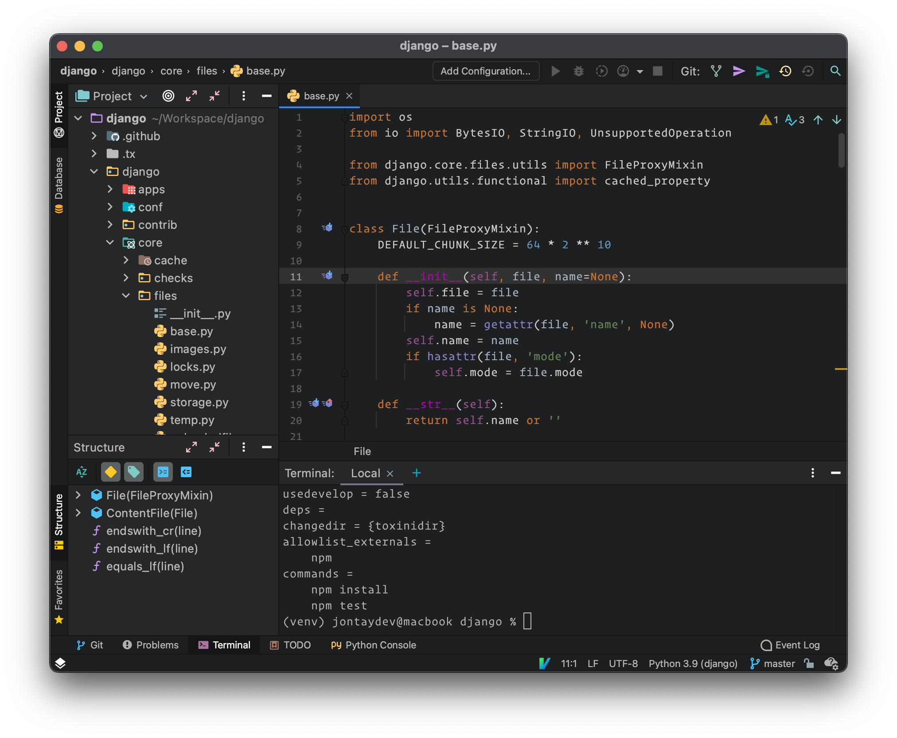
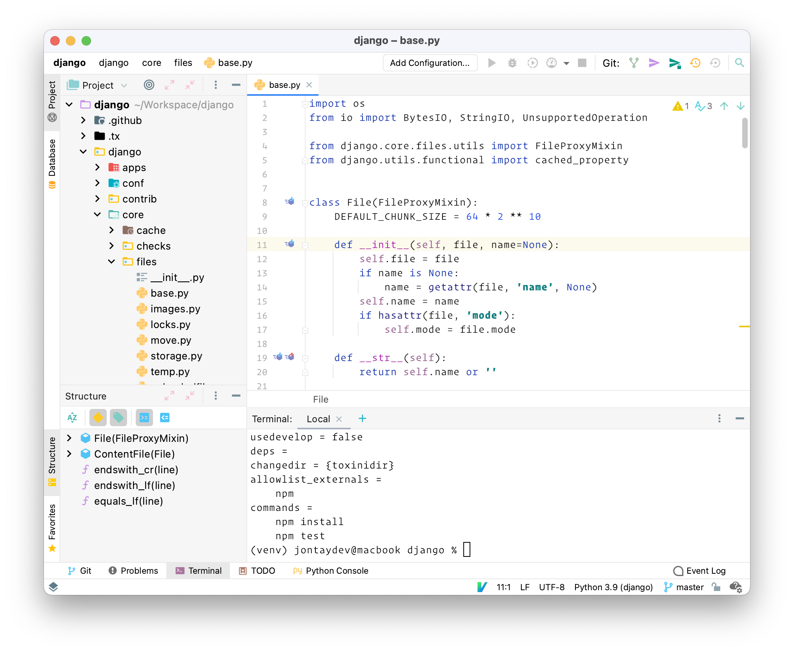

# Foundation for JetBrains

## Build

To build the plugin for IntelliJ, follow these steps:

1. Build this project with sublate From the project root: `sublate`.
2. Open the `build` directory with IntelliJ.
3. From the menubar, select Build -> Prepare Plugin Module For Deployment.
4. The plugin jar file will be exported to the `build` directory.

## Screenshots

### Foundation Dark:

### Foundation Light:

